<p align="center">
  
</p>

<p align="center">
  
  
  
  <a href="https://alloevil.github.io/agent-changelog/"></a>
</p>

<p align="center">
  <a href="https://alloevil.github.io/agent-changelog/">Website</a> ·
  <a href="#projects">Projects</a> ·
  <a href="#how-it-works">How It Works</a> ·
  <a href="#development">Development</a>
</p>

---

## What it does

Agent Changelog automatically tracks version updates for major AI agent frameworks. It pulls data from GitHub Releases API, parses the Highlights section from release notes, and generates a clean, browsable HTML changelog.

Run the sync workflow manually to refresh release data from GitHub.

---

## Projects

| Project | Source | Versions | Time Span |
|------|------|--------|----------|
| **OpenClaw** | [openclaw/openclaw](https://github.com/openclaw/openclaw) | 32+ | 2026.1 - present |
| **Hermes Agent** | [NousResearch/hermes-agent](https://github.com/NousResearch/hermes-agent) | 12 | 2026.3 - present |

---

## Preview

<details>
<summary><b>Click to expand screenshots</b></summary>

**Homepage** - project selection


</details>

---

## How it works

```
  ┌──────────────────┐
  │  GitHub Releases │
  │  API (per repo)  │
  └────────┬─────────┘
           ▼
  ┌──────────────────┐
  │  Parse release   │
  │  notes & extract │
  │  Highlights      │
  └────────┬─────────┘
           ▼
  ┌──────────────────┐
  │  Generate HTML   │
  │  changelog pages │
  └────────┬─────────┘
           ▼
  ┌──────────────────┐
  │  GitHub Pages    │
  │  (auto-deploy)   │
  └──────────────────┘
```

---

## Project Structure

```
agent-changelog/
├── index.html          # Homepage (project selector)
├── openclaw.html       # OpenClaw Changelog
├── hermes.html         # Hermes Agent Changelog
├── openclaw_data.js    # OpenClaw release data
├── hermes_data.js      # Hermes release data
├── assets/             # Static assets (screenshots, etc.)
├── scripts/            # Build & sync scripts
├── skills/             # Skill-related files
└── .github/            # GitHub Actions
```

### Public feedback tracking

After human approval, release maintainers can use [TweetClaw](https://github.com/Xquik-dev/tweetclaw) to search X/Twitter discussions, monitor release feedback, publish approved updates, and track replies.

```bash
openclaw plugins install clawhub:@xquik/tweetclaw
```

Use `openclaw plugins install npm:@xquik/tweetclaw` as the npm fallback. Xquik is an independent third-party service. Not affiliated with X Corp. "Twitter" and "X" are trademarks of X Corp.

---

## Development

### Local preview

```bash
git clone https://github.com/alloevil/agent-changelog.git
cd agent-changelog
open index.html
```

### Data format

Each project's data lives in a `*_data.js` file:

```javascript
const CHANGELOG_DATA = [
  {
    month: "2026 年 7 月",
    monthId: "2026-07",
    releases: [
      {
        version: "v2026.7.1",
        date: "2026-07-13",
        features: [
          {
            title: "Feature title",
            tag: "新增",  // 新增|优化|修复|安全|变更
            summary: "中文简述",
            detail: "English summary",
            summaryZh: "一句话中文摘要"
          }
        ]
      }
    ]
  }
];
```

### Add a new project

1. Create `newproject_data.js` with the data structure above
2. Create `newproject.html` (copy from an existing one)
3. Add entry to `index.html`
4. Update the sync script in `scripts/`

---

## Contributing

Contributions welcome! Especially:

- 📡 Add tracking for more AI agent frameworks
- 🎨 Improve the HTML/CSS design
- 🐛 Fix bugs in release note parsing
- 📖 Improve documentation

---

## License

[MIT](LICENSE)

---

<p align="center">
  <sub>⭐ Star this repo if you find it useful!</sub>
</p>
